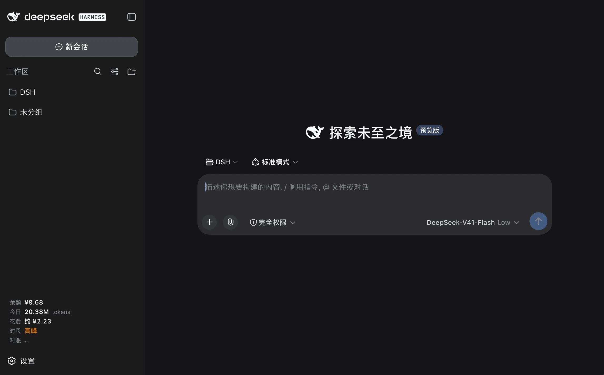
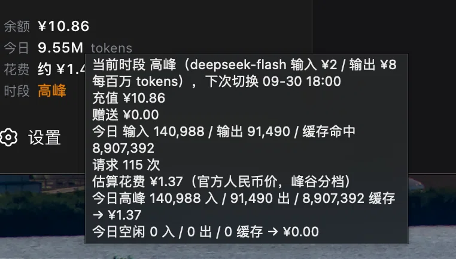

# dsh-plugin-balance-ui

[DeepSeek Harness](https://github.com/deepseek-ai)（dsh）Web 客户端的账户与用量面板。在侧边栏底部加一块：DeepSeek 账户余额、今日 token 用量、今日花费估算，以及当前处于高峰还是空闲计费档。

[English](./README.md)





## 显示什么

侧边栏展开时：

| 行 | 含义 |
| --- | --- |
| 余额 | 来自 `GET /user/balance` 的账户余额，按账户自身币种显示 |
| 今日 | 今日总 token（输入 + 输出 + 缓存命中），紧凑显示 |
| 花费 | 今日花费估算，人民币 |
| 时段 | 当前生效的计费档：`高峰` 或 `空闲` |
| 对账 | 本地估算与账户余额实际减少之间的差额，按采样覆盖完整的那些天统计（最多 7 天） |

侧边栏收起时，同样四个值以紧凑文字竖排在窄栏里。

鼠标悬停会显示完整明细：充值余额与赠送余额、输入 / 输出 / 缓存命中 token 数、请求次数、估算花费背后的高峰与空闲分档小计、当前每百万 token 费率，以及下次档位切换的北京时间。

## 数字是怎么来的

全部在本机根据 dsh 已有的数据算出，除了 DeepSeek 自己的余额接口外不请求任何服务。

- **余额** —— 宿主端用 dsh 凭据层解析出的凭证调用 `https://api.deepseek.com/user/balance`，结果缓存 30 秒。
- **用量** —— 宿主端遍历 `$DSH_HOME/sessions`（默认 `~/.dsh/sessions`）下的会话日志，解压 `.jsonl.zstd`，累计每一条时间戳在本地今日零点之后的 `assistant/message` 记录。结果缓存 10 秒。只读文件，不写回任何内容。
- **花费** —— 浏览器端按 DeepSeek 公布的人民币价目表，对每个模型行分别用高峰桶与空闲桶计价。

`reasoningTokens` 由宿主端上报但不单独计费，因为它本身是 `outputTokens` 的子集。缓存写入 token 一律按 0 计价：官方价目表只列了缓存命中输入、缓存未命中输入和输出三项。

### 高峰与空闲

DeepSeek 分两档计费，空闲档是高峰档的半价。高峰为北京时间（UTC+8）周一至周五 09:00–12:00 与 14:00–18:00，不含中国法定节假日；其余时间——包括全部周末与节假日——均为空闲。

宿主端会给每条 assistant 消息按落入的时段打标，因此每一档都按自己的费率计价，而不是取混合均价。时段徽标由独立定时器驱动、直接调度到下一个北京时间的档位切换点，所以它会在 09:00 / 12:00 / 14:00 / 18:00 / 零点当场翻转，而不是最多迟一个轮询周期。

### 费率

摘自 <https://api-docs.deepseek.com/zh-cn/quick_start/pricing>，人民币 / 每百万 token：

| 模型 | 档位 | 输入 | 输出 | 缓存命中 |
| --- | --- | --- | --- | --- |
| `deepseek-flash` | 高峰 | ¥2 | ¥8 | ¥0.04 |
| `deepseek-flash` | 空闲 | ¥1 | ¥4 | ¥0.02 |
| `deepseek-v4-pro` | 高峰 | ¥9 | ¥27 | ¥0.3 |
| `deepseek-v4-pro` | 空闲 | ¥4.5 | ¥13.5 | ¥0.15 |

已下线的 id `deepseek-v4-flash` 与 `deepseek-v4-flash-vision-exp` 映射到 `deepseek-flash`，因为服务端仍接受这两个名字并按 Flash 价格计费。价目表里没有的模型会标为无费率，花费行显示 `—`，不做猜测。

2026 年中国法定节假日为显式列表，来源是《国务院办公厅关于2026年部分节假日安排的通知》（国办发明电〔2025〕7号）。调休上班的周六周日无需登记，因为周末本来就按空闲计价。**这份节假日表每年需要更新一次**——下一年度的通知在每年 11 月发布。列表未覆盖的年份按「没有节假日」处理，只会让工作日高峰时段的花费略微高估，不会出错。

**花费数字是估算，不是账单。** 它由本机记录的 token 数与公开价目表算出，不知道折扣、赠送额度，也不知道本次发布之后 DeepSeek 的任何调价。

## 对账：为什么估算会和账单对不上

一个会悄悄偏离真实账单的估算，比没有估算更糟；而本机没有任何单一数据源能看到这个偏差——会话日志记录的是 dsh **用了多少**，只有账户知道**实际扣了多少**。

所以宿主端定时采样账户余额——无论浏览器是否开着，每 15 分钟一次，页脚轮询时也顺带采样一次——并在本机保留一小段历史。消耗按相邻两次采样之间余额的**减少量**求和还原。增加量永不计作消耗，而是区分为充值（`topped_up_balance` 上升）或赠送（`granted_balance` 上升）。

页脚的 `对账` 行显示两者的差额，悬停提示按天拆开，并列出每一条它确实能观测到的原因：

**只比较采样真正覆盖了整天的那些天**，所以窗口会随着采样积累从一整天逐步长到七天。采样不完整的那一天会被排除，而不是拿去和覆盖了整天的估算相比——否则每次新装都会在第一天报出一个很大的假差额。面板会写明它实际用的窗口；刚装好时这一行显示 `样本不足`，直到第一个完整日可用。

- **本机没看到的调用。** 实际扣费高于日志估算——来自其他客户端、直连 API，或已被清理的会话日志。
- **折扣或赠送抵扣。** 实际扣费低于估算。
- **额度变动。** 窗口内的充值与赠送入账会单独列出，避免被误当成消耗。
- **采样空档。** 减少量记在**后一次**采样所在的本地日；如果一次充值和一部分消耗落在同一个空档里，两者可能互相抵消而把消耗藏起来。当最大空档大到足以造成这种影响时，面板会说明。
- **节假日归属。** 窗口内的中国法定节假日会被列出，因为它们按空闲档计价。
- **无费率模型。** 不在费率表内的模型会被明确指出，而不是悄悄按 0 计价。

**有两处盲区是明说的，不做掩饰。** 本地会话记录根本没有缓存写入字段，所以如果 DeepSeek 对缓存写入计费，这部分对本估算不可见，面板会无条件说明这一点。此外只对 **CNY** 账户做对账：费率表是人民币的，其他币种账户会留作不比较，而不是错误地比较。

## 安装

在插件市场（dsh-market）里搜索 `balance-ui`。

或从命令行：

```sh
dsh plugin --profile web add dsh-plugin-balance-ui
```

然后重启 dsh 服务以重新合成 profile 层。

## 前置条件

- 一个使用 Web 应用的 dsh profile。
- dsh 凭据层中可用的 DeepSeek API key，名为 `DEEPSEEK_API_KEY`。没有它时用量各行照常工作，只有余额行显示错误。
- Node.js ≥ 22.15.0（宿主端使用 `zlib.zstdDecompressSync`）。

## 路由

宿主端注册四个同源、只读的 JSON 路由：

| 路由 | 内容 |
| --- | --- |
| `GET /dsh-balance` | `{ ok, available, infos: [{ currency, total, granted, toppedUp }] }` |
| `GET /dsh-usage` | 今日 token 总数、高峰/空闲分桶，以及按模型分组的行 |
| `GET /dsh-usage-history?days=7` | 同样的结构，按本地日拆分，支持 1–30 天 |
| `GET /dsh-spend-ledger?days=7` | 按天采样的账户变动，以及充值、赠送与采样空档 |

四个路由都会拒绝非 `GET`/`HEAD` 方法与跨源请求，并返回 `cache-control: no-store`。

## 隐私

API key 只在 dsh 进程内解析，仅用于调用上游余额接口。它不会出现在任何响应、日志或错误信息中。会话日志只读，不写入。

本插件唯一会写的东西是自己的余额采样库：`$DSH_HOME/dsh-plugin-balance-ui/balance-samples.json`（默认 `~/.dsh/dsh-plugin-balance-ui/balance-samples.json`）。里面只有时间戳和上游接口本来就返回的四个余额数字——没有 key、没有提示词、没有 token 数——并只保留最近 120 天。删掉该文件是安全的：插件会重新开始采样，对账回到 `样本不足`。

没有遥测，也不接第三方服务。

## 测试

```sh
npm test
```

运行 `node:test` 测试套件，零依赖：峰谷日历、余额账本算法（消耗、充值、赠送、覆盖范围、采样空档）、按天折叠（用合成的会话日志）、对账算法（含非人民币账户的保护），以及路由端到端（对着伪造的 cordis 上下文与打桩的上游）。

## 许可

MIT，见 [LICENSE](./LICENSE)。
